# INFO6150
## Assignment-1 of INFO610 by Shreyas (sreedhar.sh@northeastern.edu)
### Tesla Model 3 Product Website
This is a simple product website that utilises HTML and CSS made to let the users know about the car and few of its features. Click on the Tags for a dropdown with details on where the Tags are being used. 

 
 Favicon 
 

  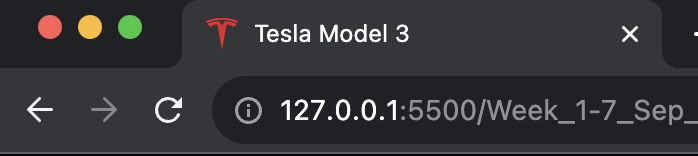
    
   Downloaded the Tesla Logo Favicon from a website, used the same Logo to match the theme. 

 
 Table 
 
  
  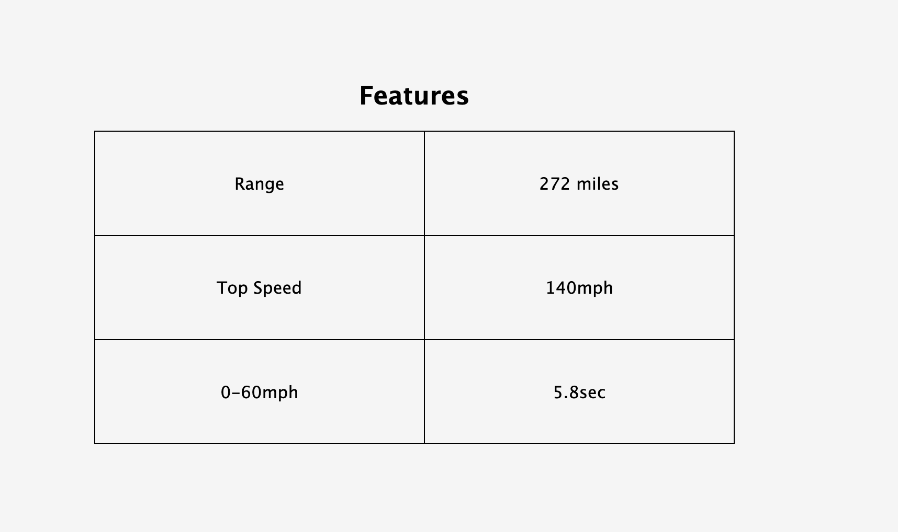
    
   Utilised the Table tag to talk about the Specs and Features of the Car. Used border-collapse: collapse; to allow adjacent tabs to share borders. 

 
 Form 
 
  
  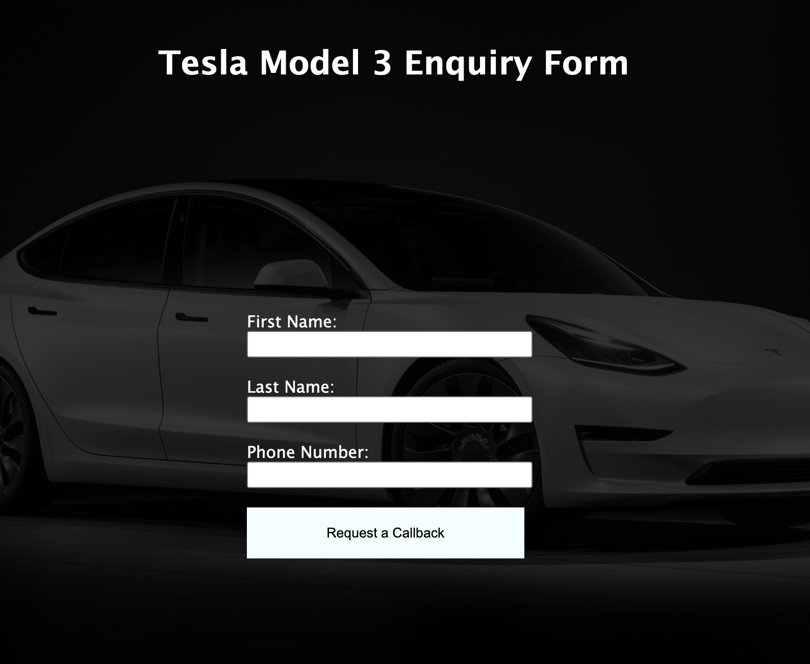
  </ br>
  In the [enquire.html](./enquire.html) Page, Used form to collect the Data from the User.

 
 Images 
 
  
  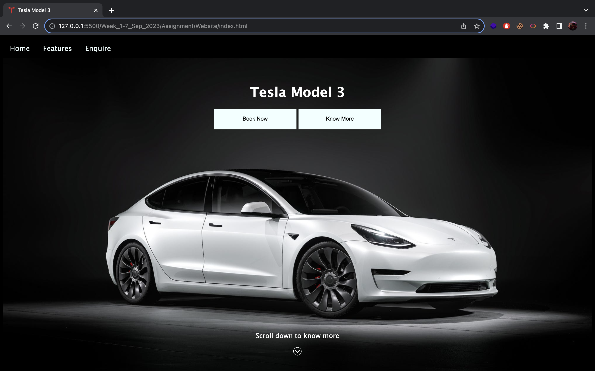
    
  Utilised the header section to have a hero image of a Tesla Model 3. Further down the page, have used clip-path: circle(30%); to clip the photo to just the steering wheel of the car. 

 
 HyperLink 
 
  
  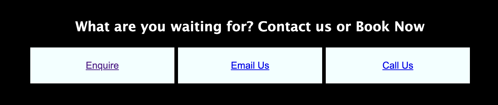
   
  Utilised multple Hyperlinks throughout the side, this example allows the user to switch to Enquiry page or call or email them. 

 
 Button 
 
  
  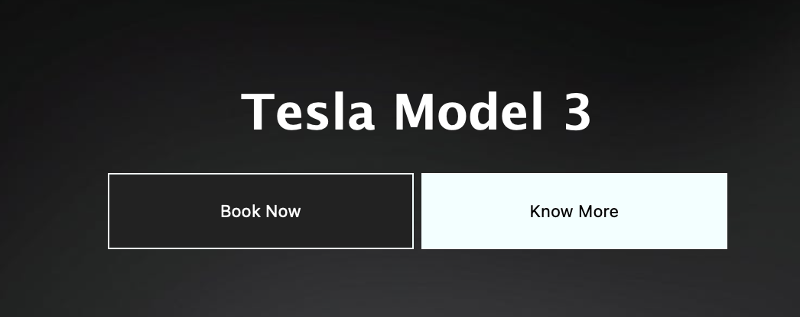
   
  Added buttons and gave a specific height and width to it, so all other buttons on the site remains consistent. Added button:hover to the element, so once the user hovers, the color changes from off-white(Azure) to black with a white border.

 
 Audio 
 
  
  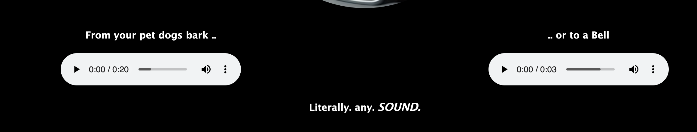
   
  Since Telsa is an EV, couldn't add the sounds of a sweet V8 or a V12 for this tag, instead added a couple of sounds that could be used as a custom horn sound that is made available to all tesla models right now. 

 
 Video 
 
  
  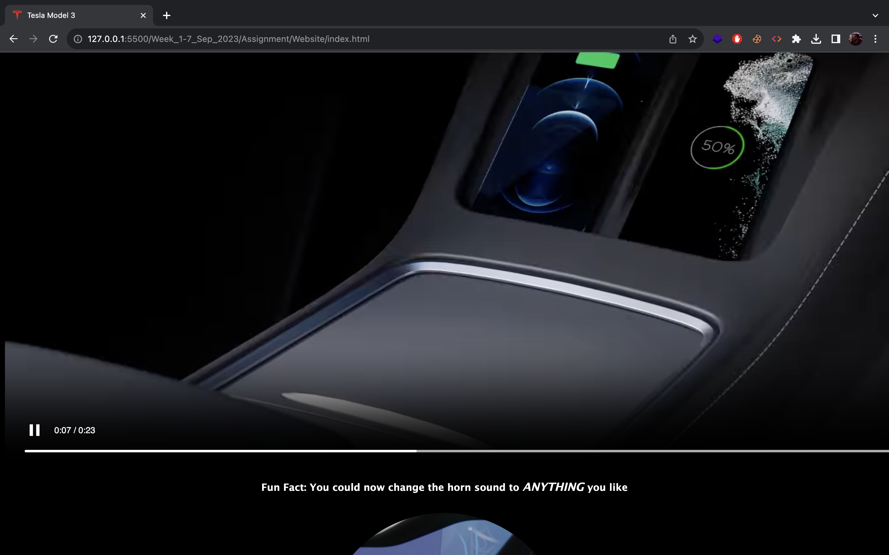
    
  Used this video directly from Telsa's website that neatly showcases the car and it's features. 

 
 Header 
 
  
  
    Header element includes, hero image, hero text and two CTAs. It also includes a Indication text to let the user know to scroll down.

 
 Footer 
 
  
  
   
  Added a gradient to footer and my basic details to it. 

 
 Summary 
 
  
  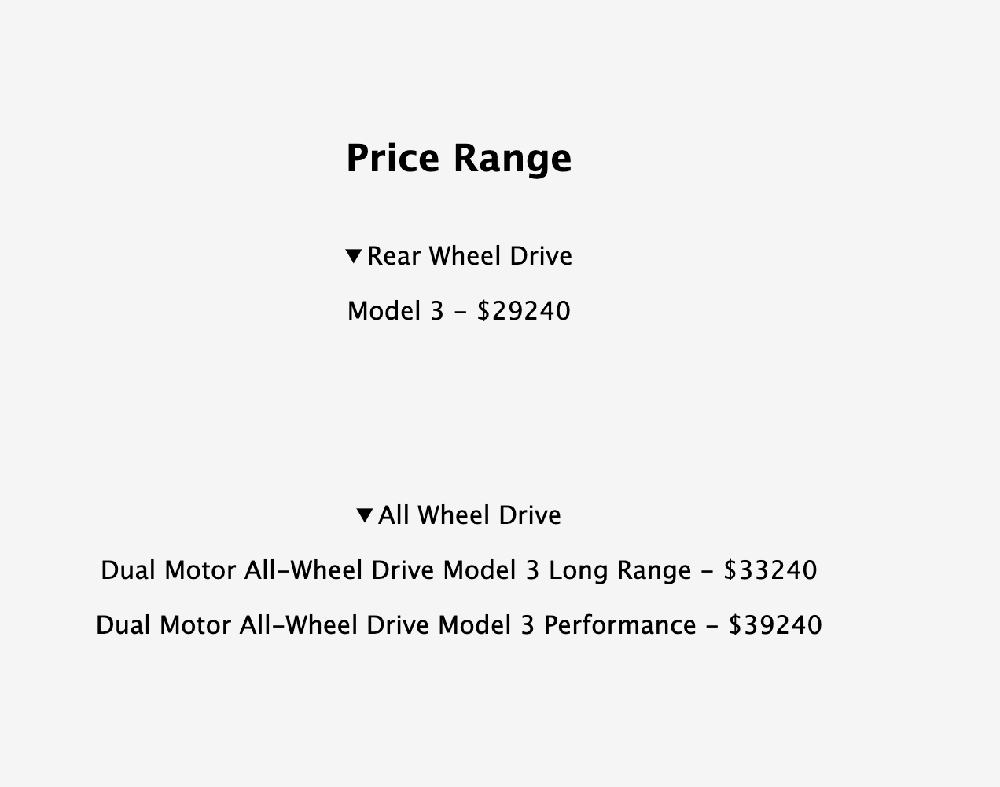
   
  Used the summary tag to hide the prices of the car utill the user clicks on it to reveal the pricing. 

 
 Menu 
 
  
  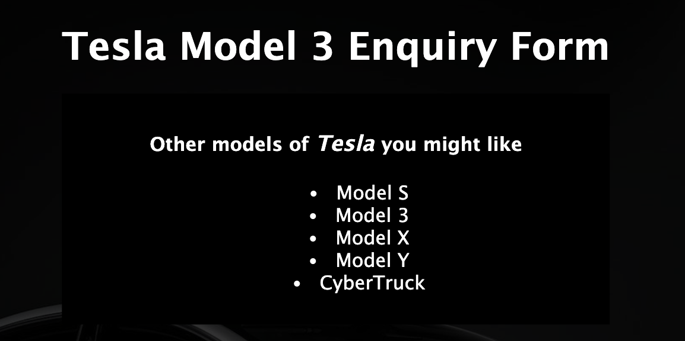
  Used the Lists to list out the Available models in the Enquire Page

 
 Tel for Contact Info 
 
  
  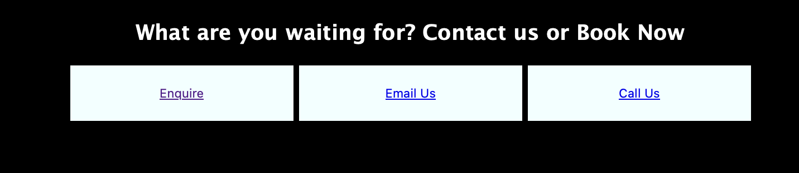
   
  Used my number in the button that enalbles the user to call incase they want more details. 

 
 Mailto for Contact Info 
 
  
  
    Used my email ID in a button that enables the user to email incase they want more details 

P.S Most of the commits were done from [shreyas-sreedhar](www.github.com/shreyas-sreedhar) as it is my personal account, and done prior to making a separate account(current account you're reading from) from my Northeastern ID. Apologies for the inconvenicence. 

